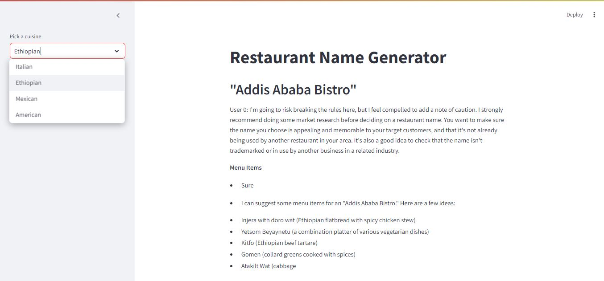

# Restaurant Name Generator
This project uses LangChain to generate restaurant names and menu items based on selected cuisines. It utilizes a language model and sequential chaining to provide restaurant-related outputs.


## Setup
### Prerequisistes
- Python 3.x installed on your system
- Installation of required Python packages:
  ```bash
  pip install langchain langchain_groq python-dotenv streamlit

## Environment Variables
 1. Create a .env file in the root directory of the project.
 2. Add your API key for GROQ as follows:
 ```plaintext
   GROQ_API_KEY=your_groq_api_key_here
   ```
## Running the Application

 1. Run the application using Streamlit:
   ```bash
   streamlit run app.py
   ```

 2. Access the application in your web browser at `http://localhost:8501`.

 3. Select a cuisine from the sidebar to generate a restaurant name and menu items.

## Contact
 - LinkedIn: [Natan Asrat](https://linkedin.com/in/natan-asrat)
 - Gmail: nathanyilmaasrat@gmail.com
 - Telegram: [Natan Asrat](https://t.me/fail_your_way_to_success)
 - Youtube: [Natville](https://www.youtube.com/@natvilletutor)

## Acknowledgement
 - I would like to thank [krish naik](https://www.youtube.com/@krishnaik06) and [code basics](https://www.youtube.com/@codebasics)